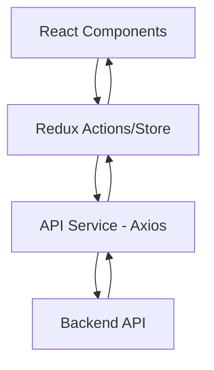
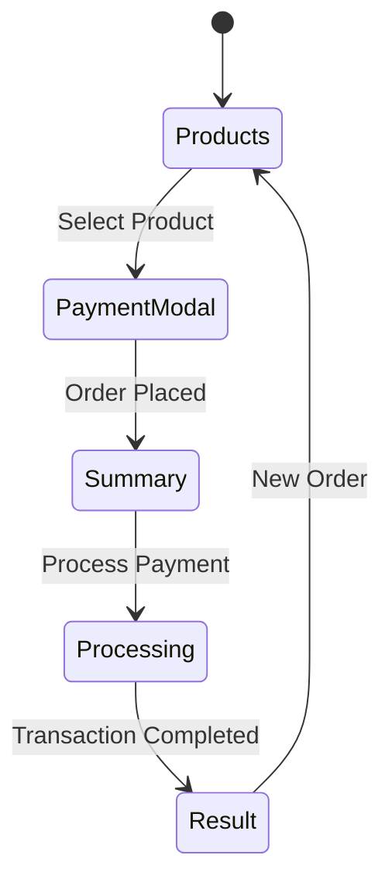

# Payment Checkout System - Frontend


## 📋 Descripción
Esta es la interfaz de usuario para el sistema de checkout de pagos. Proporciona una experiencia de compra fluida y reactiva, permitiendo a los usuarios seleccionar productos, ingresar información de contacto y entrega, y completar transacciones de pago de manera segura. La aplicación interactúa directamente con el API backend para orquestar el proceso de pago.

## ✨ Características Principales
*   **Grid de Productos:** Visualización atractiva de productos con información en tiempo real.
*   **Checkout Multi-paso:** Proceso guiado para recolección de datos y pago.
*   **Gestión de Estado Centralizada:** Uso de Redux para un flujo de datos predecible.
*   **Diseño Responsivo:** Adaptado para dispositivos móviles y escritorio.
*   **Feedback en Tiempo Real:** Indicadores de carga y estados de éxito o error.
*   **Vanilla CSS:** Estilos personalizados sin frameworks externos pesados.

## 🏗️ Arquitectura
La aplicación sigue un enfoque basado en componentes y una arquitectura de flujo de datos unidireccional (Redux).



*   **Components:** Piezas de UI reutilizables y contenedores de páginas.
*   **Store:** Gestiona el estado global (productos, carrito, paso actual, estados de carga).
*   **Services:** Abstracción para las llamadas al API backend.

## 📁 Estructura del Proyecto
```text
src/
├── components/          # Componentes de UI (Páginas y Modales)
│   ├── ProductsPage.js  # Catálogo inicial
│   ├── PaymentModal.js  # Formulario de pago
│   ├── SummaryPage.js   # Resumen post-pago
│   └── ResultPage.js    # Resultado final de la transacción
├── store/               # Configuración de Redux (Store y Reducers)
├── services/            # Lógica de comunicación con el API (Axios)
├── styles/              # Archivos CSS puros para diseño y animaciones
├── utils/               # Funciones auxiliares
└── App.js               # Orquestador principal de pasos
```

## 🛠️ Tecnologías
*   **Librería Principal:** [React.js](https://reactjs.org/)
*   **Manejo de Estado:** [Redux](https://redux.js.org/)
*   **Iconografía:** [Lucide React](https://lucide.dev/)
*   **Estilos:** CSS3 Puro (Vanilla CSS)
*   **Cliente HTTP:** [Axios](https://axios-http.com/)
*   **Testing:** [React Testing Library](https://testing-library.com/docs/react-testing-library/intro/) & [Jest](https://jestjs.io/)

## 💾 Flujo de Datos
El estado global orquestado por Redux maneja la transición entre los diferentes estados del checkout.



## 🚀 Instalación y Configuración

1.  **Clonar el repositorio:**
    ```bash
    git clone [url-del-repo]
    cd payment-checkout-system-front
    ```

2.  **Instalar dependencias:**
    ```bash
    npm install
    ```

3.  **Configurar variables de entorno:**
    Crea un archivo `.env` basado en `.env.example`.
    ```bash
    cp .env.example .env
    ```

4.  **Iniciar en modo desarrollo:**
    ```bash
    npm start
    ```

## 🔌 API Service
El frontend consume los siguientes servicios del backend (configurable vía proxy o env):
*   `GET /products`: Carga inicial del catálogo.
*   `POST /payments/transaction`: Creación de la intención de pago.
*   `GET /payments/transaction/:id`: Polling del estado final del pago.

## 🧪 Testing
Se incluyen pruebas unitarias y de integración para los componentes críticos y el estado.

```bash
# Ejecutar pruebas
npm test

# Ejecutar con reporte de cobertura
npm test -- --coverage --watchAll=false
```

## 📦 Deployment
El frontend está containerizado para facilitar su despliegue en cualquier entorno.

**Opción 1: Despliegue con Docker (Recomendado)**
```bash
npm run docker:up
```
Esto construirá la imagen optimizada y servirá la aplicación en el puerto configurado.

**Opción 2: Build Manual**
Para generar los archivos estáticos manualmente:
```bash
npm run build
```
Los archivos resultantes en la carpeta `build/` pueden servirse mediante Nginx, S3 + CloudFront o Netlify/Vercel.

## 🔒 UX/UI Highlights
*   **Micro-animaciones:** Transiciones suaves entre estados para una mejor percepción de velocidad.
*   **Validación Inline:** Feedback inmediato al usuario durante el llenado de formularios.
*   **Skeleton Loading:** Mejora de la experiencia de carga inicial.

## 🎯 Flujo de Usuario (Frontend)
1.  **Exploración:** Navega por el catálogo y selecciona un producto.
2.  **Datos:** Completa el formulario multi-paso con datos de envío y pago.
3.  **Confirmación:** Revisa el resumen final antes de procesar el pago.
4.  **Resultado:** Visualiza el estado final (Aprobado/Rechazado) con detalles del pedido.

## 🤝 Contribución
Las contribuciones son bienvenidas. Por favor, asegúrate de que todas las pruebas pasen antes de enviar un PR.

## 📄 Licencia
Este proyecto está bajo la licencia MIT.
